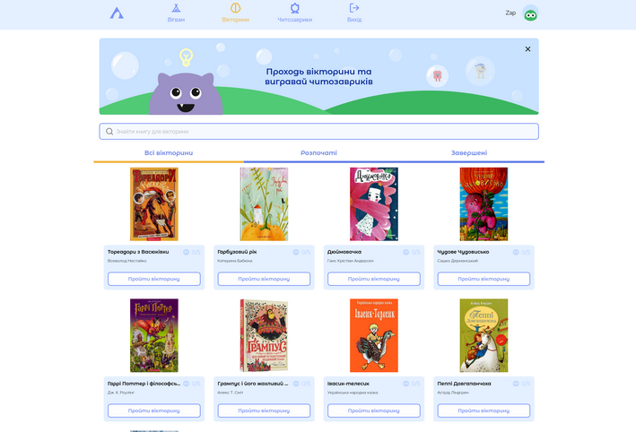

### Cypress_projectChytozavryk_Version_2.0
### The Chytozavryk project is aimed at instilling love in children. The project has special game quizzes that ask questions about the plots of children's books. To get a prize in the quiz, you need to read the book

___

- The project is running on a new environment, modified according to bug reports
- Most selectors have been changed to new, more stable ones
- Added performance testing on artillery
- Reporting using the Mocha library   
____

